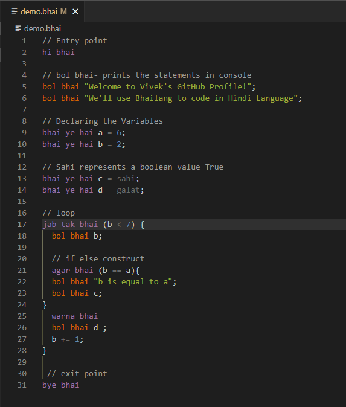
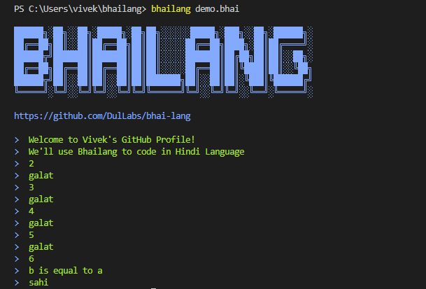

# Bhailang (The forbidden 'Brocode')


“Okay! This syntax is intimidating for me. Maybe programming is not my cup of tea”. We all had a similar notion while carving our path into the coding world as coding involves a wide array of programming languages. There is plethora of programming languages such as C++, Python, JavaScript, R, etc. but not a single one in Hindi language.

Well, not anymore. Let me present to you “Bhailang” (Yeah, I know. So cool right?). For those who don’t know “Bhai”, it is Indian word for brother. It is a toy language written in Typescript which is created by two Indian developers – Aniket Singh from Amazon and Rishabh Tripathi from Groww.

**Note:** The term ‘toy language’ refers to any computer programming language that does not meet the standards for general purpose applications.

Similar to other programming languages “Bhailang” too has its own syntax and every instruction in the language contains the word “bhai”. The code is only valid when written inside the tags “hi bhai” and “bye bhai” and everything outside of it will be ignored.

And my personal favorite part is the when the language throws error messages like **Arre Bhai Bhai Bhai!!!**, **kya kar rha hai tu??**, **Variable ‘a’ bana to le pehle**. And when we run the code successfully, it gives “Shandar Bhai” message as output. Speechless!! 

The language has its own [website](https://bhailang.js.org/) and [GitHub page](https://github.com/DulLabs/bhai-lang) where anyone can check the source code and how the entire directory uses built-ins, loops and conditional statements. There is no change for numbers and strings, however, boolean values have been changed to “sahi” and “galat” and null values to “nalla”.


## Key Terminologies

- **Entry & Exit point:** A program must begin with a **hi bhai** and end with a **bye bhai**. 
- **Variables:** Variables are declared with **bhai ye hai**.
- **Datatype:** Numbers and strings are just like any other language. Null values are indicated with **nalla**. **Sahi** and **Galat** represent boolean values.
- **Output:** Any console output can be printed with **bol bhai**.
- **Conditionals:** If the condition is **sahi** (True), then the **agar bhai** (if) block will be executed, and if the condition is **galat** (false), then the **warna bhai** (else)  block will be executed.
- **Loops:** **jab tak bhai** blocks execute statements as long as a specified condition evaluates to **sahi** (true). Upon reaching **galat**, the statement within the loop stops executing, and control passes to the statement following the loop.
- **Control Statements:** Break the loop with **bas kar bhai** (break) and continue within it with **agla dekh** (continue) bhai.
- **Errors:** It throws a syntax error with **kya kar rha hai tu** statement.


## Installation

-	**Note:** Node should be installed into your system as it’s a node package. [Download node js](https://nodejs.org/en/)
-	**Global Installation:** ```npm i -g bhailang```
-	Create a folder “BhaiLang” and open it using VS Code or any other IDE.
-	Create a file **“demo.bhai”** inside the folder. **“.bhai”** is the bhailang extension. 
-	**Optional:** Add more extensions by searching “bhailang” (Bhailang – syntax highlight, autocomplete extension) on VS Code.


## Usage/Examples

In this example, we will declare a few variables and explore the use of conditions and loops along with few other functionalities in Bhailang. 

1. Starting with a simple example. 
<!--  -->


You'll get an interesting error: **kya kar rha hai tu??**. Now, adding ";" after the print statement the error is resolved.



